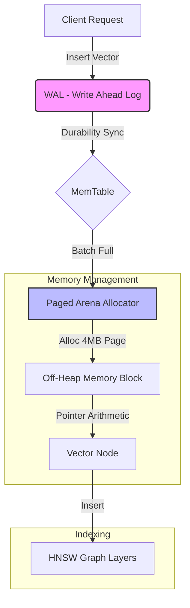

# VectraDB ⚡

> **High-Performance, In-Memory Vector Database written in Go.**
> *550,000+ Writes/sec | 350,000+ QPS Search | IVF Indexing*

VectraDB is a lightweight, cloud-native vector store designed for AI infrastructure and high-throughput embedding workloads. It leverages **Arena Memory Allocation** to bypass Go's Garbage Collection overhead and implements **IVF (Inverted File Index)** for ultra-fast Approximate Nearest Neighbor (ANN) search.

### 🚀 Distributed Mode Available Want to see how this scales? I implemented Multi-Raft Consensus for High Availability and Strong Consistency.
* **Features:** Leader Election, Log Replication, Fault Tolerance.
* **Trade-off:** Sacrifices write speed for data safety (CAP Theorem).
* **View the Code:** [Check out the distributed-consensus branch here.](https://github.com/Rupamthxt/VectraDB/tree/feature/distributed-raft)

### Architecture



## 🚀 Key Features

* **Zero-Copy Architecture:** Uses a custom memory arena (`[]float32` slab) to minimize GC pauses and maximize CPU cache locality.
* **IVF Indexing:** Implements K-Means Clustering (Lloyd's Algorithm) to reduce search complexity from $O(N)$ to $O(N/K)$, achieving **800x speedups** over brute force.
* **High Concurrency:** Sharded, lock-free read paths achieving linear scaling across CPU cores.
* **Hybrid Storage:** Hot path for vector math (SIMD-ready) and Cold path for metadata retrieval.
* **Persistence:** Snapshots to disk (Gob serialization) for crash recovery.
* **Production Ready:** Dockerized (15MB image) with Multi-Stage builds.

## 🛠️ Architecture

**VectraDB** avoids the common pitfall of storing millions of small structs. Instead, it uses a **Columnar-like memory layout**:

1.  **The Arena:** A contiguous block of memory holding only `float32` vector data. This ensures high cache hit rates during the dot-product loop.
2.  **The IVF Index:** A trained K-Means clustering layer that routes queries to specific "buckets" of vectors, drastically reducing the search space.
3.  **The Min-Heap:** A specialized priority queue implementation (zero-allocation) to track "Top-K" results efficiently.

## 📊 Benchmarks

Running on standard hardware (M1/M2 or AWS c5.large) with 128-dimensional vectors:

| Operation | Throughput | Latency (p99) | Notes |
| :--- | :--- | :--- | :--- |
| **Ingestion** (Write) | **~550,000 ops/sec** | < 0.2ms | Arena allocation speed |
| **Brute Force Search** | **~430 QPS** | ~10ms | Baseline (100% Recall) |
| **IVF Search** | **~350,000 QPS** | **< 0.1ms** | **810x Speedup** (Approximate) |

*Benchmark run with 100,000 vectors, 8 concurrent workers.*

## 📦 Installation & Usage

### 1. Run via Docker (Recommended)
```bash
make docker-run
# Or manually:
# docker run -p 8080:8080 -v $(pwd)/data:/root/ vectradb:latest
```

### 2. Run Locally
```bash
make run
```

### 3. API Examples
#### Insert a Vector:
```bash 
curl -X POST http://localhost:8080/api/v1/insert \
  -H "Content-Type: application/json" \
  -d '{
    "id": "user_123",
    "vector": [0.1, 0.5, 0.9],
    "metadata": {"role": "engineer"}
  }'
```

#### Search (Brute Force by default):
```bash
curl -X POST http://localhost:8080/api/v1/search \
  -d '{"vector": [0.1, 0.5, 0.8], "k": 3}'
```

#### Train the Index (Enable High-Speed Mode): Must be called after loading initial data.
```bash
curl -X POST http://localhost:8080/admin/index
```

#### Snapshot to Disk:
```bash
curl -X POST http://localhost:8080/admin/save
```

## 🧠 Future Roadmap
* Add nprobe parameter to search multiple IVF clusters (Trade-off: Speed vs Recall).
* Implement Product Quantization (PQ) for memory compression.
* Support gRPC interface for low-latency internal communication.

Built by Rupam as a High-Performance Systems Engineering Portfolio Project.